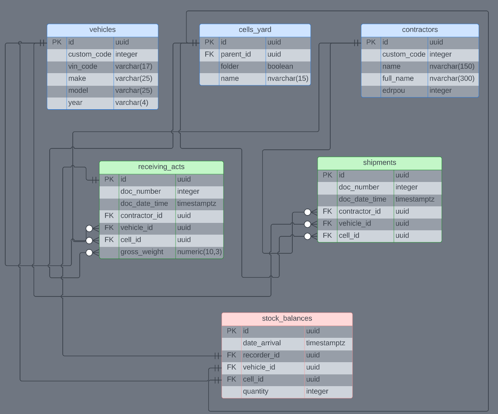

# Used Car Warehouse Management System

### Description:
This is a simple web application for managing a warehouse of used cars.  
The application allows for the registration of car acceptance and shipment at the warehouse.

### Technologies:
The project was developed in **Java** using:
* Spring Boot
* Spring Data JPA
* Hibernate
* PostgreSQL
* RESTful
* Spring Security

### Database ER diagram:

### Usage:
* Register the acceptance of transport at the warehouse
* Register the shipment of transport from the warehouse (in progress)
* Viewing warehouse stock, location of transport (in progress)